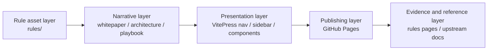

# Site Blueprint

This page explains how the whitepaper-style shell is organized so the project does not fall back into being only a rule catalog.

## Why the blueprint matters

The architecture view tells tech leads, architects, and platform teams where each kind of content belongs.
That boundary is what keeps the site coherent as it grows.

## Four-layer chain

## Responsibilities by layer

1. **Rule asset layer** keeps the canonical rule corpus.
2. **Narrative layer** explains value, structure, and action in order.
3. **Presentation layer** turns that story into a compact executive shell.
4. **Publishing layer** gives the project a stable public surface.
5. **Evidence layer** connects rules and external references back to the decision flow.

## How to use it

1. Confirm the value case in the [Decision Brief](../whitepaper/decision-brief).
2. Read the [Information Graph](./information-graph) to see how pages connect.
3. Map the [Adoption Path](../playbook/adoption-path) to your own team.
4. Use the [Rules Evidence Library](../rules/) as validation, not as the first stop.

<SectionCallout
  title="Blueprint principle"
  body="Value belongs in whitepaper pages, structure belongs in architecture pages, action belongs in the playbook, and proof belongs in the evidence library."
  href="./information-graph"
  label="View the information graph"
/>
