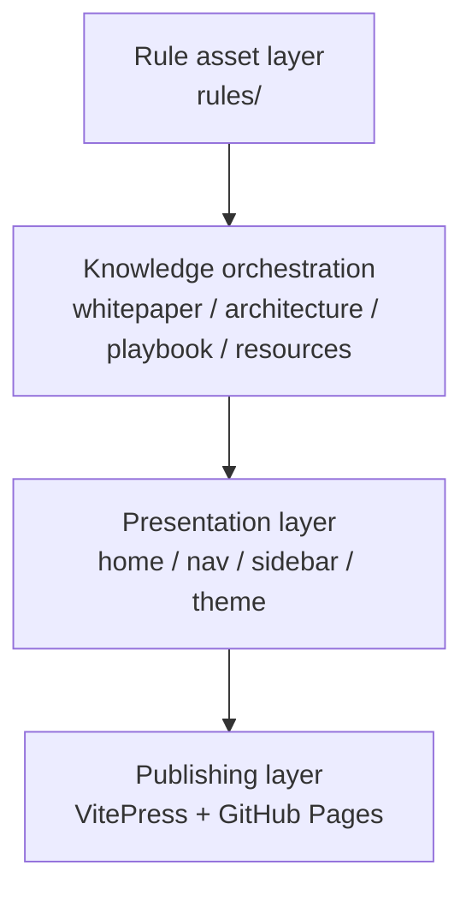

# Site Blueprint

## Architecture goal

The redesign is meant to establish a durable information architecture:

1. home explains the project position,
2. navigation maps to knowledge domains,
3. rules remain the asset atlas instead of the entire site,
4. external links become part of the user journey.

## Four-layer structure

## Why the kimi-cli framework influence works

The kimi-cli docs structure is clean, compact, and content-forward.  
This site adopts that framing while pushing harder on whitepaper and architecture content.
