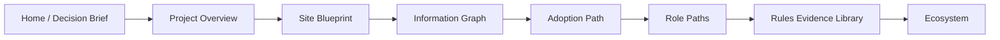

# Information Graph

This page shows how the homepage, whitepaper, architecture, playbook, rules, and resources connect into a single reading path.

## Why it matters

Without an information graph, the site looks like disconnected sections.
With it, readers can see one system: value first, then structure, then action, then evidence.

## Reading chain

## What each node answers

| Node | Main question | Outcome |
| --- | --- | --- |
| Home / brief | Is this worth organizational attention? | A value decision |
| Whitepaper / architecture | How is the system organized? | Structural understanding |
| Playbook | How should we adopt it? | A rollout path |
| Rules evidence | What proof and samples support the decision? | Concrete examples |
| Ecosystem | Where do we go next? | External connections |

## Recommended use

1. Start with the [Decision Brief](../whitepaper/decision-brief) and [Project Overview](../whitepaper/overview).
2. Use the [Site Blueprint](./blueprint) to understand boundaries.
3. Continue to the [Adoption Path](../playbook/adoption-path) and [Role Paths](../playbook/role-paths).
4. Then use the [Rules Evidence Library](../rules/) and [Ecosystem](../resources/ecosystem).

<SectionCallout
  title="Communication tip"
  body="When presenting the project to a team, explain value first, structure second, action third, and only then show rule samples."
  href="../playbook/role-paths"
  label="Continue to role paths"
/>
