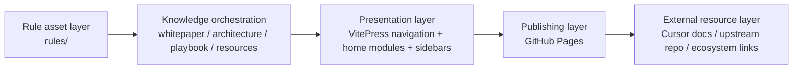

  

    

      
AR

      

        Awesome Cursor Rules Atlas
        Whitepaper / Architecture Showcase
      

    

    

      <a href="./whitepaper/overview">Whitepaper</a>
      <a href="./architecture/blueprint">Architecture</a>
      <a href="./resources/ecosystem">Resources</a>
      <a href="../zh/">中文</a>
    

  

  

    

      
Technical whitepaper / architecture showcase

      <h1>Move Cursor rules from a file catalog to an operational knowledge system.</h1>
      

        This site is no longer a README mirror. It is a structured knowledge surface around rule assets,
        adoption paths, architectural thinking, and curated ecosystem links. Start with intent, move into
        implementation, and end with reusable references you can apply in real teams.
      

      

        Start from the current whitepaper, architecture, playbook, and resource sections directly rather than relying on removed legacy entry pages.
      

    

    

      <strong>132+</strong> rule assets
      <strong>32+</strong> domains
      <strong>Bilingual</strong> docs
      <strong>Long-term</strong> design
    

  

## Site positioning

  

    

      
Whitepaper framing

      

        Explain why the project exists, who it is for, and how rules become engineering assets instead of one-off prompts.
      

      

        <a href="./whitepaper/overview" class="feature-tag">Overview</a>
        <a href="./whitepaper/adoption-model" class="feature-tag">Adoption model</a>
      

    

    

      
Architecture storytelling

      

        Show how rule assets, docs, publishing, and external links fit together instead of only listing categories.
      

      

        <a href="./architecture/blueprint" class="feature-tag">Site blueprint</a>
        <a href="./architecture/content-system" class="feature-tag">Content system</a>
      

    

    

      
Operational playbook

      

        Turn individual usage patterns and team governance into repeatable steps that can evolve over time.
      

      

        <a href="./playbook/adoption-path" class="feature-tag">Adoption path</a>
        <a href="./playbook/operating-model" class="feature-tag">Operating model</a>
      

    

    

      
Resource network

      

        Connect official docs, upstream repositories, prompt engineering references, and adjacent tools.
      

      

        <a href="./resources/ecosystem" class="feature-tag">Ecosystem</a>
        <a href="./resources/extended-reading" class="feature-tag">Extended reading</a>
      

    

    

      
Rule atlas

      

        Keep category browsing, but place it inside a broader knowledge architecture with guidance and context.
      

      

        <a href="./rules/" class="feature-tag">All rules</a>
        <a href="./rules/frontend" class="feature-tag">Frontend</a>
        <a href="./rules/backend" class="feature-tag">Backend</a>
      

    

    

      
Aggressive redesign by default

      

        The site favors long-term clarity and structure over backwards compatibility with the old information layout.
      

      

        <a href="./changelog" class="feature-tag">Changelog</a>
        <a href="./contributing" class="feature-tag">Contributing</a>
      

    

  

## Adoption path

  

    

      
01

      <h3>Identify project shape</h3>
      
Start by understanding whether you are serving a solo app, team repo, monolith, or multi-package workspace.

    

    

      
02

      <h3>Choose baseline rules</h3>
      
Use one general rule plus a primary stack rule, then layer specialized domains like security or data only when needed.

    

    

      
03

      <h3>Capture organizational knowledge</h3>
      
Move naming conventions, testing discipline, and architecture boundaries into the rule corpus so the guidance compounds.

    

    

      
04

      <h3>Create a review loop</h3>
      
Review rule changes through pull requests and release cycles so the rule system evolves with the codebase.

    

  

## Architecture view

  

    
The new GitHub Pages experience is designed as a knowledge surface built from four connected layers.

  

  

    

      <h3>Source of truth</h3>
      
<code>rules/</code> remains the canonical asset library while the docs site explains and connects those assets.

    

    

      <h3>Knowledge orchestration</h3>
      
Whitepaper pages explain intent, architecture pages explain structure, playbook pages explain action, and resources extend the surface.

    

    

      <h3>Presentation layer</h3>
      
The design follows the lighter kimi-cli-style framework: compact home framing, strong sidebars, shallow navigation.

    

    

      <h3>Feedback loop</h3>
      
Changelog, contributing guidance, and templates feed learnings back into the rule asset layer for continuous growth.

    

  

## Curated resources

  

    

      <h3>Official and upstream</h3>
      <ul>
        <li><a href="https://cursor.sh/" target="_blank" rel="noreferrer">Cursor official site</a></li>
        <li><a href="https://docs.cursor.com/" target="_blank" rel="noreferrer">Cursor Docs</a></li>
        <li><a href="https://github.com/PatrickJS/awesome-cursorrules" target="_blank" rel="noreferrer">Original Awesome Cursor Rules repo</a></li>
      </ul>
    

    

      <h3>Internal key entry points</h3>
      <ul>
        <li><a href="./whitepaper/overview">Project overview</a></li>
        <li><a href="./architecture/blueprint">Site blueprint</a></li>
        <li><a href="./playbook/adoption-path">Adoption path</a></li>
      </ul>
    

    

      <h3>Further reading</h3>
      <ul>
        <li><a href="./resources/ecosystem">Ecosystem index</a></li>
        <li><a href="./resources/extended-reading">Prompt and documentation references</a></li>
        <li><a href="./rules/">Rule atlas</a></li>
      </ul>
    

  

  

    
Suggested first move

    

      Read the <a href="./whitepaper/overview">overview</a> and <a href="./playbook/adoption-path">adoption path</a>,
      then move into the <a href="./rules/">rule atlas</a>. If you are responsible for platform or team enablement,
      continue with the <a href="./architecture/blueprint">architecture blueprint</a> and the
      <a href="./resources/ecosystem">ecosystem index</a>.
    

  

