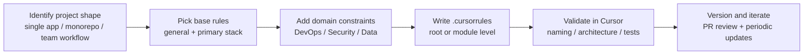

## Core metrics

  

    
132+

    
Rule files

    
Production-oriented coverage from mainstream stacks to niche technical domains.

  

  

    
32

    
Categories

    
Clear taxonomy for frontend, backend, mobile, AI, DevOps, security, and beyond.

  

  

    
2

    
Locale sites

    
Bilingual docs for cross-language teams and smoother collaboration workflows.

  

  

    
1

    
Operational loop

    
Choose → apply → validate → evolve, so rules become a repeatable team capability.

  

## Rule rollout blueprint

  
Use this path to turn “rule collection” into stable day-to-day output quality.

## High-value rule combinations

<table class="combo-table">
  <thead>
    <tr>
      <th>Scenario</th>
      <th>Recommended combo</th>
      <th>Why it works</th>
    </tr>
  </thead>
  <tbody>
    <tr>
      <td>React full-stack web</td>
      <td><code>nextjs-typescript</code> + <code>fastapi-best-practices</code></td>
      <td>Aligns frontend typing and backend API discipline with fewer integration mismatches.</td>
    </tr>
    <tr>
      <td>Vue business apps</td>
      <td><code>nuxt3</code> + <code>code-guidelines</code></td>
      <td>Balances framework conventions with cross-team readability and review consistency.</td>
    </tr>
    <tr>
      <td>Cross-platform mobile</td>
      <td><code>react-native-expo</code> / <code>flutter-app-expert</code></td>
      <td>Improves component structure and state patterns without heavy custom prompting.</td>
    </tr>
    <tr>
      <td>AI product engineering</td>
      <td><code>mlops</code> + <code>python-data-processing</code></td>
      <td>Bridges experimentation and production concerns in one coherent rule context.</td>
    </tr>
    <tr>
      <td>Cloud-native delivery</td>
      <td><code>docker-containerization</code> + <code>terraform-iac</code> + <code>ci-cd-pipelines</code></td>
      <td>Connects development, infrastructure, and delivery automation into one pipeline.</td>
    </tr>
    <tr>
      <td>Security-sensitive systems</td>
      <td><code>zero-trust</code> + <code>smart-contract-security</code></td>
      <td>Moves security constraints earlier into implementation instead of late-stage patches.</td>
    </tr>
  </tbody>
</table>

  <a class="chip-link" href="/en/rules/frontend">Frontend</a>
  <a class="chip-link" href="/en/rules/backend">Backend</a>
  <a class="chip-link" href="/en/rules/mobile">Mobile</a>
  <a class="chip-link" href="/en/rules/ai">AI</a>
  <a class="chip-link" href="/en/rules/devops">DevOps</a>
  <a class="chip-link" href="/en/rules/security">Security</a>
  <a class="chip-link" href="/en/rules/data-science">Data Science</a>
  <a class="chip-link" href="/en/rules/blockchain">Blockchain</a>

## Three upgrade paths

  

    <h3>Path A: solo project acceleration</h3>
    
Start with one primary rule, stabilize output quality, then add project-specific constraints incrementally.

    <a href="/en/getting-started">Open quick start →</a>
  

  

    <h3>Path B: team consistency</h3>
    
Version <code>.cursorrules</code> in Git and review updates in PRs to reduce style drift across contributors.

    <a href="/en/best-practices">Open best practices →</a>
  

  

    <h3>Path C: internal knowledge base</h3>
    
Convert architecture decisions and lessons learned into reusable rule templates for onboarding and scaling.

    <a href="/en/guides/rule-template">Open template guide →</a>
  

## Practical knowledge blocks

  

    <h3>Constrain before generation</h3>
    
Define naming, layering, and API boundaries up front to avoid expensive rewrite cycles later.

    <a class="knowledge-link" href="/en/best-practices">Read practice guide →</a>
  

  

    <h3>Use layered rules</h3>
    
Keep global conventions at root and domain-specific logic in subdirectories for better signal quality.

    <a class="knowledge-link" href="/en/getting-started">See setup method →</a>
  

  

    <h3>Examples beat adjectives</h3>
    
“Write clean code” is weak guidance. Include positive and negative examples with measurable constraints.

    <a class="knowledge-link" href="/en/guides/rule-template">Open templates →</a>
  

  

    <h3>Split conflicting intent</h3>
    
If one rule tries to cover frontend and backend simultaneously, split it to avoid unstable suggestions.

    <a class="knowledge-link" href="/en/troubleshooting">Open troubleshooting →</a>
  

  

    <h3>Treat rules as product assets</h3>
    
Review generated output after each release cycle and refine outdated constraints continuously.

    <a class="knowledge-link" href="/en/changelog">Open changelog →</a>
  

  

    <h3>Standardize onboarding</h3>
    
Reading rules before coding helps new members align with architecture and style much faster.

    <a class="knowledge-link" href="/en/contributing">Open contributing guide →</a>
  

## Quick diagnosis table

<table class="quick-fix-table">
  <thead>
    <tr>
      <th>Symptom</th>
      <th>First action</th>
      <th>Priority</th>
      <th>Entry</th>
    </tr>
  </thead>
  <tbody>
    <tr>
      <td>Rules seem ignored</td>
      <td>Confirm <code>.cursorrules</code> is in project root and restart Cursor.</td>
      <td>High</td>
      <td><a href="/en/faq">FAQ</a></td>
    </tr>
    <tr>
      <td>Inconsistent code style output</td>
      <td>Check for conflicting merged rules and split by module if needed.</td>
      <td>High</td>
      <td><a href="/en/troubleshooting">Troubleshooting</a></td>
    </tr>
    <tr>
      <td>Team output diverges</td>
      <td>Version rules in repository and review changes in PR workflow.</td>
      <td>Recommended</td>
      <td><a href="/en/contributing">Collaboration</a></td>
    </tr>
    <tr>
      <td>Need internal custom rules</td>
      <td>Start from templates and run small pilot validation before broad rollout.</td>
      <td>Pilot first</td>
      <td><a href="/en/guides/rule-template">Template guide</a></td>
    </tr>
  </tbody>
</table>

  <h3>Ready to apply rules in production workflows?</h3>
  
Pick your main stack, apply one rule, run a real coding cycle, then iterate with project constraints. In most teams, quality becomes noticeably more stable after one or two feedback loops.

  

    <a class="cta-button primary" href="/en/getting-started">Start now</a>
    <a class="cta-button" href="/en/rules/">Open rules map</a>
    <a class="cta-button" href="/en/guides/rule-template">Build team template</a>
    <a class="cta-button" href="https://github.com/LessUp/awesome-cursorrules-zh">Open GitHub</a>
  

