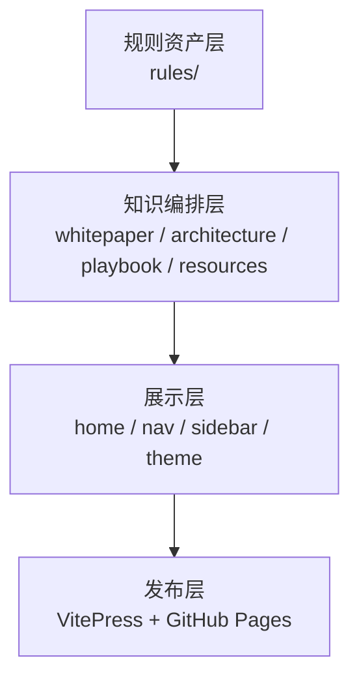

# 站点蓝图

## 架构目标

这次 GitHub Pages 重构的目标不是“更炫”，而是建立一个可以长期扩展的信息架构：

1. 让首页承担定位与导览职责。
2. 让导航直接映射内容域，而不是文档类型。
3. 让规则页继续作为资产目录，但不再是站点的唯一主角。
4. 让外部资源和内部内容之间形成清晰的跳转网络。

## 四层结构

## 每一层各自负责什么

| 层级 | 目录 / 组件 | 职责 |
| --- | --- | --- |
| 规则资产层 | `rules/` | 存放 `.cursorrules` 与规则说明 |
| 知识编排层 | `docs/zh/*` `docs/en/*` | 解释规则、组织路径、提供指导 |
| 展示层 | `docs/.vitepress/*` | 导航、样式、主页模块、搜索 |
| 发布层 | GitHub Pages | 对外分发和访问入口 |

## 为什么借鉴 kimi-cli 的框架

kimi-cli 的文档站有几个值得复用的优点：

- 首页直接表达产品定位，而不是堆砌大段营销词。
- 顶部导航按领域分区，认知负担低。
- 侧边栏围绕主题域组织，适合持续扩展。
- 视觉层足够克制，让内容本身成为主角。

本项目在此基础上进一步加强：

- 增加白皮书与架构视角。
- 引入资源网络，避免文档孤岛。
- 将规则目录纳入“知识图谱”而非“文件列表”。

## 首页模块设计

首页承担四个动作：

1. **解释定位**：告诉用户站点已经从规则目录升级为知识站。
2. **给出路径**：用“规则采用路径”展示如何开始。
3. **解释结构**：用“架构视图”说明站点如何组织内容。
4. **打开网络**：用“精选资源”把用户送向更广的生态。

## 对长期演进的意义

当未来新增内容时，只需要判断它属于哪一个内容域：

- 解释定位与原则：放进白皮书
- 解释系统与结构：放进架构
- 解释动作与治理：放进方法论
- 解释外部网络与参考：放进资源

这样新内容不会再次把首页或导航拖回无序状态。
