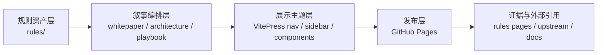

# 架构蓝图

本页解释白皮书展厅型站点如何被组织：先说明为什么要这样分层，再展示系统链路，最后给出落地时的阅读和改造顺序。

## 先回答为什么值得采用

架构页的存在，不是为了画一张“酷炫示意图”，而是为了避免项目再次退回“规则堆叠站”。

- 对技术负责人来说，蓝图说明这套内容是否值得纳入组织知识治理。
- 对架构师来说，蓝图说明规则、文档和发布面之间是否有清晰边界。
- 对平台团队来说，蓝图说明未来扩展页面时，如何不破坏整体结构。

当这些边界被定义清楚，新增内容才能持续服务同一个系统叙事。

## 再回答系统如何组织

站点采用四层链路，把资产、叙事和发布面串起来。

### 分层职责

1. **规则资产层**：保存原始规则与说明，是整个系统的权威源。
2. **叙事编排层**：把价值、结构和动作拆成可理解的阅读顺序。
3. **展示主题层**：通过 `ExecutiveHero`、`MetricBand` 等组件把页面表达成 executive brief。
4. **发布层**：用 GitHub Pages 对外提供一个稳定入口。
5. **证据与引用层**：把规则页、资源网络和外部资料连接成可验证的证据库。

## 最后回答怎样开始

如果你要用这套蓝图推动落地，建议按下面顺序执行：

1. 先确认 [决策者摘要](../whitepaper/decision-brief) 的价值判断是否成立。
2. 再用 [信息图谱](./information-graph) 检查内容域之间的关系是否清晰。
3. 然后进入 [采用路径](../playbook/adoption-path)，把蓝图映射到团队动作。
4. 最后把 [规则证据库](../rules/) 作为验证层，而不是首页主入口。

<SectionCallout
  title="蓝图原则"
  body="页面可以继续增长，但它们必须落在既有分层里：价值归白皮书，结构归架构，动作归 playbook，证据归 rules。"
  href="./information-graph"
  label="查看信息图谱"
/>
