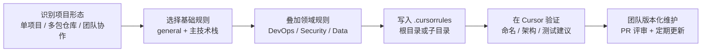

## 核心指标

  

    
132+

    
规则文件

    
覆盖主流开发场景与专业领域，支持从新项目到遗留系统演进。

  

  

    
32

    
技术分类

    
从前后端、移动端到安全、量子、仿真，分类明确，检索高效。

  

  

    
2

    
语言站点

    
中英文文档并行维护，适合跨语言团队协作与知识共享。

  

  

    
1

    
标准流程

    
从选型、落地到维护闭环，减少“规则很多但不会用”的落差。

  

## 规则落地路线图

  
建议按下面这条路径推进，让规则从“看起来很强”变成“每天都能稳定产出”。

## 精华规则组合（可直接抄作业）

<table class="combo-table">
  <thead>
    <tr>
      <th>场景</th>
      <th>推荐组合</th>
      <th>为什么有效</th>
    </tr>
  </thead>
  <tbody>
    <tr>
      <td>Web 全栈（React）</td>
      <td><code>nextjs-typescript</code> + <code>fastapi-best-practices</code></td>
      <td>前后端都强调类型与接口边界，避免上下游风格断裂。</td>
    </tr>
    <tr>
      <td>Vue 中后台</td>
      <td><code>nuxt3</code> + <code>code-guidelines</code></td>
      <td>先用框架规则保证产出，再用通用规范统一团队编码习惯。</td>
    </tr>
    <tr>
      <td>移动端跨平台</td>
      <td><code>react-native-expo</code> / <code>flutter-app-expert</code></td>
      <td>减少样板代码分歧，提升组件组织与状态管理一致性。</td>
    </tr>
    <tr>
      <td>AI 工程化</td>
      <td><code>mlops</code> + <code>python-data-processing</code></td>
      <td>把实验代码和工程代码连接起来，兼顾可复现与可部署。</td>
    </tr>
    <tr>
      <td>云原生交付</td>
      <td><code>docker-containerization</code> + <code>terraform-iac</code> + <code>ci-cd-pipelines</code></td>
      <td>开发、部署、自动化链路同源，减少环境偏差。</td>
    </tr>
    <tr>
      <td>安全敏感系统</td>
      <td><code>zero-trust</code> + <code>smart-contract-security</code></td>
      <td>把安全约束提前到编码阶段，而不是上线前补洞。</td>
    </tr>
  </tbody>
</table>

  <a class="chip-link" href="/zh/rules/frontend">前端</a>
  <a class="chip-link" href="/zh/rules/backend">后端</a>
  <a class="chip-link" href="/zh/rules/mobile">移动</a>
  <a class="chip-link" href="/zh/rules/ai">AI</a>
  <a class="chip-link" href="/zh/rules/devops">DevOps</a>
  <a class="chip-link" href="/zh/rules/security">安全</a>
  <a class="chip-link" href="/zh/rules/data-science">数据科学</a>
  <a class="chip-link" href="/zh/rules/blockchain">区块链</a>

## 三条升级路径

  

    <h3>路径 A：个人项目快速起飞</h3>
    
先选 1 条主规则，确保 Cursor 输出稳定，然后再逐步补充项目定制约束。

    <a href="/zh/getting-started">查看快速开始 →</a>
  

  

    <h3>路径 B：团队规范统一</h3>
    
将 <code>.cursorrules</code> 纳入版本控制，配合代码评审和模板，减少风格分叉。

    <a href="/zh/best-practices">查看最佳实践 →</a>
  

  

    <h3>路径 C：沉淀组织知识</h3>
    
把你们的架构决策和踩坑经验写入规则模板，形成可复用的团队资产。

    <a href="/zh/guides/rule-template">查看规则模板 →</a>
  

## 规则知识干货

  

    <h3>先约束，再生成</h3>
    
把命名、目录、接口约束写在规则前半段，比事后让 AI “重写一遍”更高效。

    <a class="knowledge-link" href="/zh/best-practices">实践细则 →</a>
  

  

    <h3>分层写规则</h3>
    
根目录写通用规范，子目录写领域细则，避免一个文件承载全部上下文而失控。

    <a class="knowledge-link" href="/zh/getting-started">配置方法 →</a>
  

  

    <h3>示例比形容词更有用</h3>
    
“应该优雅”这类描述可执行性很弱，建议提供正反示例和可检查的标准。

    <a class="knowledge-link" href="/zh/guides/rule-template">模板示例 →</a>
  

  

    <h3>冲突规则及时拆分</h3>
    
若一个规则同时服务前端和后端，常导致建议摇摆。按模块拆分能显著提升稳定性。

    <a class="knowledge-link" href="/zh/troubleshooting">排错入口 →</a>
  

  

    <h3>把规则当产品迭代</h3>
    
每次版本升级后回顾 AI 产出，删除失效约束，补充新技术边界，持续优化。

    <a class="knowledge-link" href="/zh/changelog">查看更新日志 →</a>
  

  

    <h3>团队 onboarding 标准件</h3>
    
新成员先读规则，再写代码，可以显著缩短熟悉项目风格与架构的时间。

    <a class="knowledge-link" href="/zh/contributing">贡献与协作 →</a>
  

## 常见问题速查

<table class="quick-fix-table">
  <thead>
    <tr>
      <th>症状</th>
      <th>优先动作</th>
      <th>状态</th>
      <th>入口</th>
    </tr>
  </thead>
  <tbody>
    <tr>
      <td>AI 不遵循规则</td>
      <td>确认 <code>.cursorrules</code> 在项目根目录并重启 Cursor。</td>
      <td>高优先</td>
      <td><a href="/zh/faq">FAQ</a></td>
    </tr>
    <tr>
      <td>建议风格前后不一致</td>
      <td>检查是否混用了语义冲突的多份规则。</td>
      <td>高优先</td>
      <td><a href="/zh/troubleshooting">故障排除</a></td>
    </tr>
    <tr>
      <td>团队每个人输出差异大</td>
      <td>将规则纳入仓库并在 PR 中同步审查。</td>
      <td>建议执行</td>
      <td><a href="/zh/contributing">协作指南</a></td>
    </tr>
    <tr>
      <td>想新增内部专用规则</td>
      <td>基于模板创建并先在小范围项目试运行。</td>
      <td>先灰度</td>
      <td><a href="/zh/guides/rule-template">模板指南</a></td>
    </tr>
  </tbody>
</table>

  <h3>准备把规则用到真实项目了吗？</h3>
  
从你最常用的技术栈开始，复制一条规则、跑一轮开发任务、再按结果迭代。通常一到两次迭代后，AI 产出质量会有明显提升。

  

    <a class="cta-button primary" href="/zh/getting-started">现在开始</a>
    <a class="cta-button" href="/zh/rules/">查看规则地图</a>
    <a class="cta-button" href="/zh/guides/rule-template">编写团队模板</a>
    <a class="cta-button" href="https://github.com/LessUp/awesome-cursorrules-zh">访问 GitHub</a>
  

