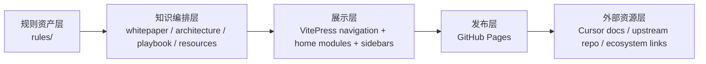

  

    

      
AR

      

        Awesome Cursor Rules Atlas
        技术白皮书 / 架构展示站
      

    

    

      <a href="./whitepaper/overview">白皮书</a>
      <a href="./architecture/blueprint">架构</a>
      <a href="./resources/ecosystem">资源</a>
      <a href="../en/">English</a>
    

  

  

    

      
技术白皮书 / 架构展示站

      <h1>把 Cursor 规则从文件收藏夹，升级为可运营的工程知识系统。</h1>
      

        这里不再只是 README 的复述，而是围绕规则资产、采用路径、架构方法和外部资源所构建的知识站。
        你可以把它当成组织级 Cursor 规则实践手册：先理解为什么、再理解怎么做，最后找到下一步可以直接使用的模板与链接。
      

      

        现在请直接从白皮书、架构、采用路径与资源网络等栏目进入当前 Atlas 结构，不再依赖旧入口页。
      

    

    

      <strong>132+</strong> 规则资产
      <strong>32+</strong> 技术领域
      <strong>双语</strong> 知识站点
      <strong>长期主义</strong> 架构设计
    

  

## 站点定位

  

    

      
白皮书视角

      

        解释项目为什么存在、适合谁使用，以及如何把规则从“灵感”变成“工程资产”。
      

      

        <a href="./whitepaper/overview" class="feature-tag">项目总览</a>
        <a href="./whitepaper/adoption-model" class="feature-tag">采用模型</a>
      

    

    

      
架构展示

      

        展示规则库、文档层、GitHub Pages 发布层与资源链接层之间的关系，而不是只堆页面。
      

      

        <a href="./architecture/blueprint" class="feature-tag">站点蓝图</a>
        <a href="./architecture/content-system" class="feature-tag">内容系统</a>
      

    

    

      
方法论沉淀

      

        把个人使用经验、团队落地策略和治理方式拆成可执行步骤，方便复用和持续演进。
      

      

        <a href="./playbook/adoption-path" class="feature-tag">采用路径</a>
        <a href="./playbook/operating-model" class="feature-tag">运行模型</a>
      

    

    

      
资源网络

      

        汇总官方文档、上游仓库、提示工程资料和相关工具，形成一个真正有延展性的入口。
      

      

        <a href="./resources/ecosystem" class="feature-tag">生态资源</a>
        <a href="./resources/extended-reading" class="feature-tag">延伸阅读</a>
      

    

    

      
规则地图

      

        保留规则分类浏览能力，但把它纳入整体知识架构，而不是让它成为站点的唯一内容。
      

      

        <a href="./rules/" class="feature-tag">全部规则</a>
        <a href="./rules/frontend" class="feature-tag">前端</a>
        <a href="./rules/backend" class="feature-tag">后端</a>
      

    

    

      
长期演进

      

        允许你激进重构导航、主题和内容结构，以长期收益优先，而不是被旧页面兼容性绑住。
      

      

        <a href="./changelog" class="feature-tag">更新日志</a>
        <a href="./contributing" class="feature-tag">贡献指南</a>
      

    

  

## 规则采用路径

  

    

      
01

      <h3>识别项目形态</h3>
      
先判断你面对的是个人项目、团队仓库、单体仓还是多包仓，这会决定规则边界和治理方式。

    

    

      
02

      <h3>选择基础规则</h3>
      
用通用规则 + 主技术栈规则做骨架，再按安全、数据、基础设施等领域叠加专业约束。

    

    

      
03

      <h3>沉淀组织知识</h3>
      
把你的命名规范、目录约束、测试要求和架构决策写回规则文件，形成组织自己的知识资产。

    

    

      
04

      <h3>建立评审闭环</h3>
      
让规则与 PR、代码评审和版本演进绑定，而不是停留在“复制一份 .cursorrules 就结束”的层面。

    

  

## 架构视图

  

    
新的 GitHub Pages 被设计成知识站，而不是静态清单。核心是把规则、文档、方法论与资源链接组织成四层结构。

  

  

    

      <h3>资产源</h3>
      
<code>rules/</code> 继续作为权威规则资产源，文档站只做解释、导航和组织，不直接复制资产职责。

    

    

      <h3>知识编排</h3>
      
白皮书解释定位，架构页解释结构，方法论页给出操作路径，资源页打开生态连接。

    

    

      <h3>发布界面</h3>
      
采用接近 kimi-cli 的轻量框架：首页像产品概览，侧边栏按内容域分组，避免导航过深。

    

    

      <h3>反馈回路</h3>
      
通过更新日志、贡献指南和规则模板，把用户贡献重新送回资产层，形成持续生长的知识回路。

    

  

## 精选资源

  

    

      <h3>官方与上游</h3>
      <ul>
        <li><a href="https://cursor.sh/" target="_blank" rel="noreferrer">Cursor 官方站点</a></li>
        <li><a href="https://docs.cursor.com/" target="_blank" rel="noreferrer">Cursor Docs</a></li>
        <li><a href="https://github.com/PatrickJS/awesome-cursorrules" target="_blank" rel="noreferrer">Awesome Cursor Rules 上游仓库</a></li>
      </ul>
    

    

      <h3>站点内部关键入口</h3>
      <ul>
        <li><a href="./whitepaper/overview">项目总览：为什么要做这个站</a></li>
        <li><a href="./architecture/blueprint">站点蓝图：为什么这样设计</a></li>
        <li><a href="./playbook/adoption-path">采用路径：如何在真实项目里落地</a></li>
      </ul>
    

    

      <h3>扩展阅读</h3>
      <ul>
        <li><a href="./resources/ecosystem">工具与生态资源索引</a></li>
        <li><a href="./resources/extended-reading">提示工程、文档工程与知识库建设参考</a></li>
        <li><a href="./rules/">规则分类总览</a></li>
      </ul>
    

  

  

    
建议的起步动作

    

      先读 <a href="./whitepaper/overview">项目总览</a> 与 <a href="./playbook/adoption-path">采用路径</a>，再进入
      <a href="./rules/">规则库</a> 找到适合你栈的规则组合；如果你负责团队或平台，再继续看
      <a href="./architecture/blueprint">架构蓝图</a> 与 <a href="./resources/ecosystem">资源网络</a>。
    

  

