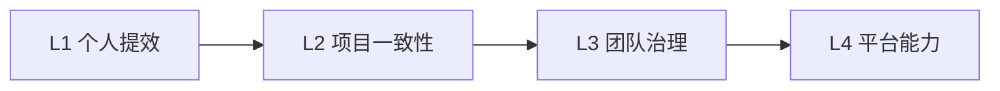

# 采用模型

## 四层采用模型

我们把 Cursor 规则的采用分成四层，从“个人可用”到“组织资产”逐步升级。

### L1：个人提效

- 目标：让单个开发者快速获得更稳定的 AI 输出。
- 方法：选择 1 条主规则，直接复制到项目根目录。
- 产出：命名、目录、代码风格更稳定。

### L2：项目内一致性

- 目标：同一个项目内的多人协作减少风格漂移。
- 方法：将 `.cursorrules` 纳入版本控制，并在评审中审视规则变更。
- 产出：AI 输出不再完全依赖个人口味。

### L3：团队治理

- 目标：让规则成为团队级的编码约束与经验沉淀。
- 方法：建立模板库、目录级规则、更新日志和冲突治理机制。
- 产出：新成员能更快理解项目约束，旧成员能更快复用成熟经验。

### L4：平台能力

- 目标：把规则库建设成组织 DevEx 的组成部分。
- 方法：按领域维护规则资产，配合内网文档、模板仓库、PR 模板与脚手架工具。
- 产出：规则成为平台标准件，而不是孤立配置文件。

## 每一层的判断信号

| 层级 | 关键问题 | 成功信号 |
| --- | --- | --- |
| L1 | AI 输出是否更稳定？ | 重复指令明显减少 |
| L2 | 团队成员输出是否更一致？ | PR 中风格争议减少 |
| L3 | 规则是否可维护？ | 有模板、记录、责任边界 |
| L4 | 是否形成组织资产？ | 规则被跨项目复用 |

## 推荐升级路径

## 常见误区

### 误区一：一次性写满全部规则

问题：规则过长、冲突过多、维护成本陡增。  
建议：先从通用约束和主技术栈开始，再逐层扩展。

### 误区二：把规则当作静态文档

问题：技术栈变了，规则没变；团队实践变了，规则没变。  
建议：让规则跟着版本、评审和事故复盘一起迭代。

### 误区三：规则只有作者自己懂

问题：离开原作者后规则无法维护。  
建议：通过本站的白皮书、架构页、方法论页，把解释性交付补齐。
